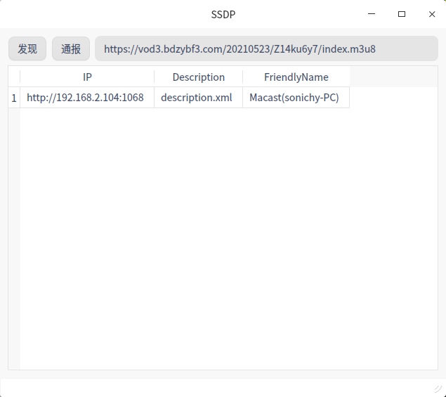

# HTYDLNA
A mini DLNA sender, can not receive yet.  

## Test
| Soft | Pass | Status |
|:----:|:----:|:----:|
| [Macast](https://github.com/xfangfang/Macast) | V | Fast |
| [极光TV](https://tv.qq.com) | V | Fast |
| [奇异果TV](http://app.iqiyi.com/tv/player/) | V | Fast |
| [酷喵](https://www.youku.com) | X ||
| Kodi | X | Occasionally|
| [恒星播放器](https://www.stellarplayer.com) | X ||
| [乐播](https://www.lebo.cn) | X | SDK |
| Windows Media Player 12 | X ||
| 小米电视 | X ||

## Debug Tool
sudo ngrep -W byline -d any "Macast" port 1900

## Local Server
python3 -m http.server

## Reference
https://blog.csdn.net/sinat_33859977/article/details/113567847  
https://github.com/sYCH3L/TwitchTVDLNAPlayer  
[UPnP Architecture](http://www.upnp.org/specs/arch/UPnP-arch-DeviceArchitecture-v1.0.pdf)